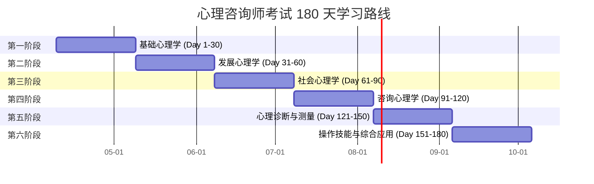

# 🧠 心理学知识库 - Psychology Knowledge Base

> 📚 心理咨询师考试自学知识库 | 180 天系统化学习路径 | 每日自动更新

[](https://opensource.org/licenses/MIT)
[](https://github.com/yourusername/psychology-knowledge-base/stargazers)
[](https://github.com/yourusername/psychology-knowledge-base/issues)
[](https://github.com/yourusername/psychology-knowledge-base/commits/main)

---

## 📖 项目简介

这是一个为**心理咨询师考试**设计的自学知识库系统，提供为期 6 个月（180 天）的系统化学习内容。

### ✨ 核心特点

- **📅 每日自动更新**：通过 GitHub Actions 每天自动生成新的学习内容
- **📚 完整知识体系**：涵盖基础心理学、发展心理学、社会心理学等 8 大模块
- **🎯 循序渐进**：从基础理论到实践技能，6 个阶段逐步深入
- **✍️ 配套练习**：每天 10 道精选习题 + 详细答案解析
- **📊 进度追踪**：清晰的学习进度管理和可视化统计
- **🌐 在线访问**：支持 GitHub Pages 在线浏览，无需下载

### 🎓 适合人群

- 准备参加心理咨询师考试的自学者
- 心理学爱好者，希望系统学习心理学知识
- 心理咨询从业者，需要复习和巩固基础知识
- 教育工作者，想了解心理学基础理论

---

## 📁 目录结构

```
psychology-knowledge-base/
├── README.md                 # 项目说明（本文件）
├── index.json                # 知识库存索和学习进度
├── learning-plan.md          # 完整 6 个月学习计划
├── USER_GUIDE.md             # 使用指南
├── .github/
│   └── workflows/
│       └── daily-sync.yml    # GitHub Actions 自动同步脚本
├── daily-lessons/            # 每日学习内容
│   ├── day-001.md            # Day 1: 心理学概述
│   ├── day-002.md            # Day 2: 心理学的神经生理机制
│   └── ...                   # 持续更新中...
└── practice-questions/       # 配套练习题
    ├── day-001-questions.md  # Day 1 练习题
    ├── day-002-questions.md  # Day 2 练习题
    └── ...                   # 持续更新中...
```

---

## 🗺️ 学习路线图

整个学习计划分为 6 个阶段，每个阶段 30 天：



### 📋 各阶段详细内容

| 阶段 | 主题 | 天数 | 核心内容 |
|------|------|------|----------|
| **第一阶段** | 基础心理学 | Day 1-30 | 心理学概述、神经生理机制、感觉知觉、意识注意、记忆、思维、语言、动机情绪、能力人格 |
| **第二阶段** | 发展心理学 | Day 31-60 | 胎儿婴儿期、幼儿期、童年期、青春期、青年期、中年期、老年期心理发展 |
| **第三阶段** | 社会心理学 | Day 61-90 | 社会认知、社会态度、社会影响、人际关系、群体心理、从众行为、偏见歧视 |
| **第四阶段** | 咨询心理学 | Day 91-120 | 精神分析、行为疗法、认知疗法、人本主义、咨询技术、咨访关系 |
| **第五阶段** | 心理诊断与测量 | Day 121-150 | 心理评估、临床访谈、测量学基础、智力测验、人格测验、心理健康评估 |
| **第六阶段** | 操作技能与综合应用 | Day 151-180 | 障碍识别、危机干预、案例分析、伦理规范、考试技巧、综合实战 |

---

## 🚀 快速开始

### 方式一：在线浏览（推荐新手）

直接访问 [GitHub Pages](https://yourusername.github.io/psychology-knowledge-base/) 在线阅读学习内容。

### 方式二：克隆到本地

```bash
# 1. 克隆仓库
git clone https://github.com/yourusername/psychology-knowledge-base.git

# 2. 进入目录
cd psychology-knowledge-base

# 3. 查看当前学习进度
cat index.json

# 4. 开始今天的学习
# 打开 daily-lessons/day-XXX.md 文件
```

### 方式三：订阅每日更新

1. **Watch 本仓库**：点击页面右上角的 "Watch" → "All Activity"
2. **加入钉钉学习群**：扫描上方二维码加入学习交流群
3. **每日自动推送**：每天下午 5:00 自动收到当日学习内容

---

## 📅 今日学习

> 💡 **今天是第 X 天学习**：[查看今日内容](daily-lessons/day-XXX.md)

**当前阶段**: 基础心理学  
**建议学习时长**: 50 分钟阅读 + 10 分钟练习  
**已完成课程**: X / 180

### 今日学习目标

1. 理解 XXX 的核心概念和基本原理
2. 掌握相关的经典理论和重要研究
3. 运用所学知识分析和解释心理现象

[查看详细学习内容 →](daily-lessons/day-XXX.md)

---

## ⚙️ 自动化配置

### GitHub Actions 自动同步

本项目使用 GitHub Actions 实现每日自动更新：

- **触发时间**: 每天 UTC 时间 9:30（北京时间 17:30）
- **执行内容**: 
  - 生成下一天的学习内容
  - 创建配套练习题
  - 更新索引文件
  - 自动提交到仓库

### 配置步骤

1. **Fork 本仓库**到你的 GitHub 账号
2. **启用 GitHub Actions**:
   - 进入你的 Fork 仓库
   - 点击 "Actions" 标签
   - 点击 "I understand my workflows, go ahead and enable them"
3. **配置 Secrets**（可选）:
   - Settings → Secrets and variables → Actions
   - 添加需要的环境变量
4. **验证工作流**:
   - Actions 标签页会显示 "Daily Sync" 工作流
   - 等待第一次自动执行，或手动触发测试

---

## 📊 学习进度追踪

### 实时进度

查看 [`index.json`](index.json) 文件了解当前学习进度：

```json
{
  "current_day": 1,
  "total_lessons": 1,
  "current_stage": 1,
  "stages": [
    {"name": "基础心理学", "status": "in_progress"},
    {"name": "发展心理学", "status": "pending"},
    ...
  ]
}
```

### 学习统计

| 指标 | 数值 |
|------|------|
| 总课程数 | 180 天 |
| 已完成 | 1 天 |
| 完成率 | 0.56% |
| 当前阶段 | 基础心理学 |
| 预计完成日期 | 2026-10-06 |

---

## 🛠️ 开发贡献

### 本地开发

```bash
# 1. Fork 并克隆仓库
git clone https://github.com/yourusername/psychology-knowledge-base.git

# 2. 安装依赖（如需要）
pip install -r requirements.txt

# 3. 运行同步脚本测试
python sync_simple.py 1

# 4. 提交更改
git add .
git commit -m "feat: 添加第 X 天学习内容"
git push origin main
```

### 提交 PR

欢迎提交 Pull Request 改进本项目！

1. Fork 本仓库
2. 创建特性分支 (`git checkout -b feature/AmazingFeature`)
3. 提交更改 (`git commit -m 'Add some AmazingFeature'`)
4. 推送到分支 (`git push origin feature/AmazingFeature`)
5. 开启 Pull Request

### 报告问题

发现错误或有问题？请 [提交 Issue](https://github.com/yourusername/psychology-knowledge-base/issues)

---

## 📝 使用许可

本项目采用 [MIT 许可证](LICENSE)

- ✅ 可自由使用、修改和分发
- ✅ 可用于商业用途
- ✅ 允许私人使用
- ⚠️ 需保留原作者版权声明

---

## 🙏 致谢

感谢所有为心理学知识传播做出贡献的先驱们！

---

## 📬 联系方式

- **项目作者**: 朱湛锋
- **邮箱**: [your-email@example.com](mailto:your-email@example.com)
- **GitHub**: [@yourusername](https://github.com/yourusername)
- **钉钉**: 朱湛锋

---

<div align="center">

**如果这个项目对你有帮助，请给一个 ⭐ Star 支持一下！**

[⬆ 返回顶部](#-心理学知识库---psychology-knowledge-base)

</div>
